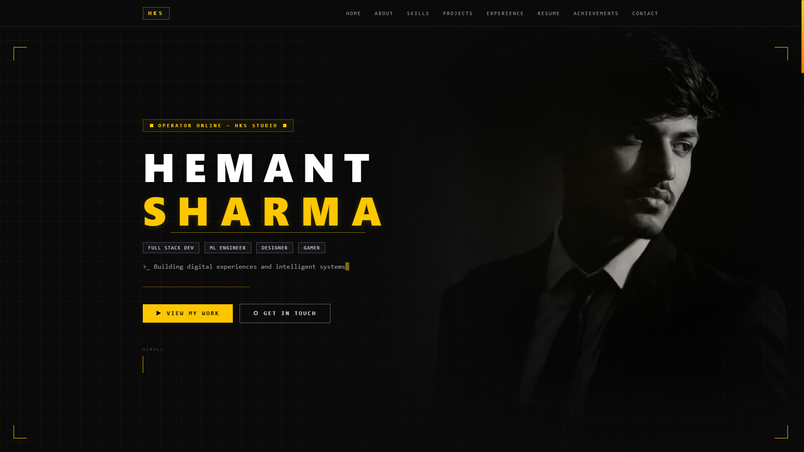
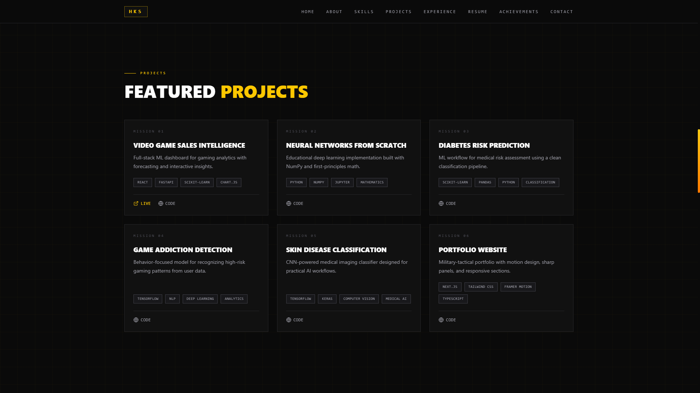
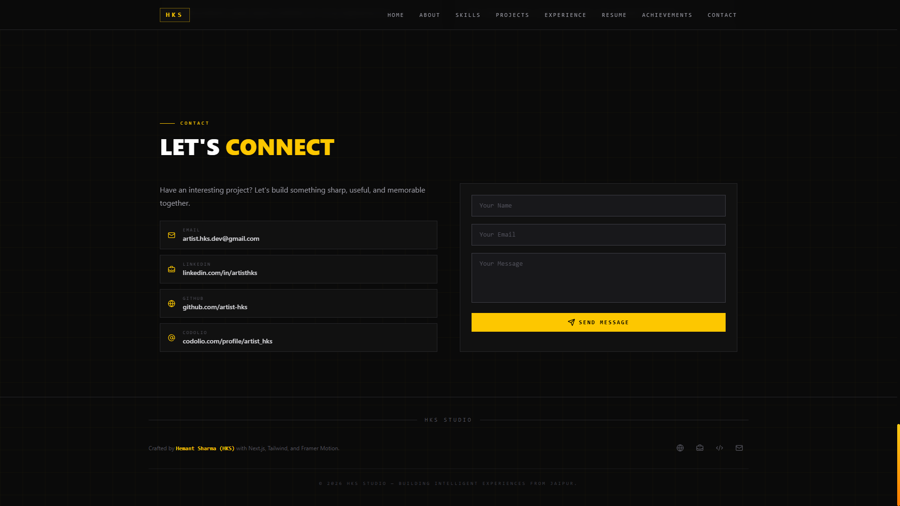

<div align="center">

# ⬡ HKS STUDIO

### *Building digital experiences and intelligent systems.*

[](https://artist-hks.vercel.app/)
[](https://nextjs.org/)
[](https://tailwindcss.com/)
[](https://www.typescriptlang.org/)
[](https://vercel.com/)
[](./LICENSE)

</div>

---

## 🌐 Live Demo

> **[https://artist-hks.vercel.app/](https://artist-hks.vercel.app/)**

---

## 📸 Preview

<div align="center">

<!-- Insert hero screenshot here -->


<!-- Insert projects section screenshot here -->


<!-- Insert contact section screenshot here -->



</div>

---

## 🧠 About the Project

**HKS Studio** is my personal portfolio — a fully custom-built digital space that reflects my identity as a developer, designer, and creator. It's not a template. Every section, animation, and interaction was designed and engineered from scratch.

The portfolio represents the intersection of three disciplines I care deeply about:

- **Full Stack Engineering** — building systems that work, scale, and ship
- **UI/UX Design** — crafting interfaces that feel intentional and premium
- **Machine Learning** — applying intelligent systems to real-world problems

The design language is cinematic and tactical — dark background, sharp yellow accents, mono typography, and motion that serves purpose rather than distraction.

---

## ✨ Features

| Feature | Description |
|---|---|
| 🎨 **Tactical UI Design** | Military-inspired aesthetic with yellow accents and sharp grid overlays |
| ⚡ **Smooth Animations** | Framer Motion powered staggered reveals, hover states, and transitions |
| ✍️ **Typewriter Effect** | Custom animated typewriter in the hero section |
| 📱 **Fully Responsive** | Pixel-perfect layout across mobile, tablet, and desktop |
| 🖼️ **Cinematic Hero** | Portrait image with multi-layer gradient blending and face masking |
| 🗂️ **Project Showcase** | Cards with live links, tech tags, and anchored CTA rows |
| 📬 **Working Contact Form** | API-connected form with validation and status feedback |
| 📄 **Resume Download** | Direct PDF download and Google Drive view options |
| 🏆 **Achievements Section** | Highlights of competitive and professional milestones |
| ⌨️ **Codolio Integration** | Live competitive programming stats pulled via API |
| 🔲 **Grid Face Masking** | Grid overlay intelligently masked away from the portrait using CSS radial masks |
| 🌑 **Cinematic Loading Screen** | 7-phase tactical HUD boot sequence with radar, particles, glitch title & scan-flash |
| 🖱️ **Custom Cursor** | Hardware-accelerated `translate3d` cursor with hover scale & 60fps RAF loop |

---

## 🛠️ Tech Stack

### Frontend
- **[Next.js 15](https://nextjs.org/)** — App Router, server components, API routes
- **[TypeScript](https://www.typescriptlang.org/)** — Type-safe throughout
- **[Framer Motion](https://www.framer.com/motion/)** — All animations and transitions
- **[Lucide React](https://lucide.dev/)** — Icon system

### Styling
- **[Tailwind CSS v4](https://tailwindcss.com/)** — Utility-first styling
- **Custom CSS** — Radial mask overlays, gradient blending, filter compositions

### Backend / API
- **Next.js API Routes** — Contact form & Codolio stats endpoints
- **[Resend](https://resend.com/)** — Transactional email delivery from contact form

### Deployment
- **[Vercel](https://vercel.com/)** — Zero-config deployment with edge network

---

## 📁 Folder Structure

```
hks-portfolio/
├── app/                        # Next.js App Router
│   ├── api/
│   │   ├── contact/            # Contact form API route (Resend)
│   │   │   └── route.ts
│   │   └── codolio/            # Codolio stats proxy API route
│   │       └── route.ts
│   ├── globals.css             # Global styles & keyframe animations
│   ├── layout.tsx              # Root layout with fonts and metadata
│   └── page.tsx                # Entry point — renders PortfolioPage
│
├── components/
│   ├── portfolio/
│   │   └── PortfolioPage.tsx   # Full portfolio page with all sections
│   └── ui/
│       ├── CustomCursor.tsx    # Hardware-accelerated custom cursor
│       └── LoadingScreen.tsx   # Cinematic 7-phase tactical boot sequence
│
├── lib/
│   ├── portfolio.ts            # Data, types, and constants
│   └── resend.ts               # Resend email helper
│
├── public/
│   ├── profile.png             # Hero portrait image
│   ├── Resume.pdf              # Downloadable resume
│   └── screenshots/            # README preview images
│
├── .env.local                  # Environment variables (not committed)
├── next.config.ts
├── tsconfig.json
└── package.json
```

---

## ⚙️ Installation & Setup

### Prerequisites
- Node.js `v18+`
- npm or pnpm

### 1. Clone the repository

```bash
git clone https://github.com/artist-hks/hks-portfolio.git
cd hks-portfolio
```

### 2. Install dependencies

```bash
npm install
# or
pnpm install
```

### 3. Configure environment variables

Create a `.env.local` file in the root:

```env
# Contact form email (Resend)
RESEND_API_KEY=re_your_api_key_here
RESEND_FROM_EMAIL=onboarding@resend.dev
CONTACT_TO_EMAIL=your_email@gmail.com
```

### 4. Run the development server

```bash
npm run dev
```

Open [http://localhost:3000](http://localhost:3000) in your browser.

### 5. Build for production

```bash
npm run build
npm start
```

---

## 📌 Future Improvements

- [ ] **Blog section** — Dev writeups and design case studies
- [ ] **Dark/light mode toggle** — With theme persistence
- [ ] **More projects** — As new work ships
- [ ] **Performance audit** — Lighthouse 100 target across all metrics
- [ ] **CMS integration** — Headless CMS for project and blog content
- [ ] **Analytics** — Privacy-first visitor insights
- [ ] **Case study pages** — Deep-dives into featured projects

---

## 🤝 Contributing

This is a personal portfolio, but if you spot a bug or have a suggestion:

1. Fork the repository
2. Create a branch — `git checkout -b fix/your-fix`
3. Commit your changes — `git commit -m "fix: describe the fix"`
4. Push and open a Pull Request

All PRs are reviewed and appreciated.

---

## 📬 Contact

| Platform | Link |
|---|---|
| 🌐 **Portfolio** | [artist-hks.vercel.app](https://artist-hks.vercel.app/) |
| 💻 **GitHub** | [@artist-hks](https://github.com/artist-hks) |
| 💼 **LinkedIn** | [linkedin.com/in/artisthks](https://linkedin.com/in/artisthks) |
| 📧 **Email** | artist.hks.dev@gmail.com |
| 🧠 **Codolio** | [codolio.com/profile/artist_hks](https://codolio.com/profile/artist_hks) |

---

## ⭐ Support

If this project inspired you, helped you learn something, or you just think it looks good —

**drop a star on the repo. It means a lot.**

[](https://github.com/artist-hks/hks-portfolio)

---

<div align="center">

**Designed & engineered by [Hemant Sharma (HKS)](https://hks-studio.vercel.app/)**

*Built with Next.js · Tailwind CSS · Framer Motion · Deployed on Vercel*

</div>
